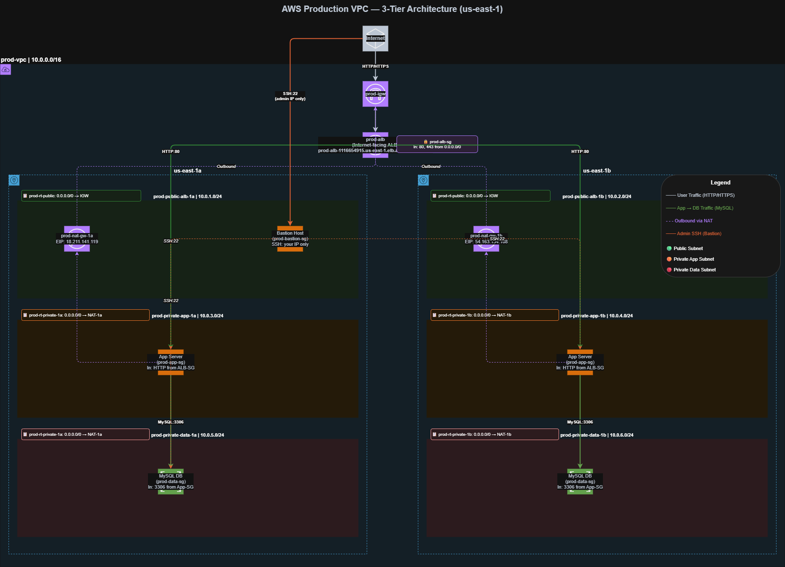

# AWS Production-Style VPC — 3-Tier Architecture

> A hands-on cloud networking project demonstrating how to design and deploy a secure, production-grade VPC on AWS from scratch — no wizards, no shortcuts.

---

## Scenario

Most AWS tutorials hand you a "VPC and more" wizard that auto-generates subnets, gateways, and route tables in seconds. That works for demos — but it leaves you with no understanding of why each piece exists, what it does, or how to troubleshoot it when something breaks in production.

The goal of this project was to build a **production-style 3-tier VPC entirely by hand** using only the AWS Console, making every decision deliberately:

- Why does a NAT Gateway live in a *public* subnet?
- Why do Security Groups reference each other instead of IP ranges?
- What actually makes a subnet "public" vs "private"?
- What happens if an availability zone goes down?

This project answers all of those questions by building the real thing.

**Target architecture:** An internet-facing Application Load Balancer routing traffic to private app servers, which talk to a private MySQL database — with zero direct internet exposure on any compute resource, and a locked-down bastion host for admin access.

---

## Obstacle

Building a secure multi-tier network on AWS involves several layers of complexity that beginners and even intermediate engineers frequently get wrong:

**Network design mistakes** are permanent until you rebuild. A misconfigured CIDR block, a subnet in the wrong availability zone, or a route table pointed at the wrong gateway cannot be easily patched — they require tearing down and starting over.

**Security Group misconfiguration is silent.** AWS does not warn you when you open port 3306 to `0.0.0.0/0` — it just does it. The difference between a locked-down database and a publicly accessible one is a single dropdown selection, and the wrong choice has caused some of the largest data breaches in cloud history.

**High availability is easy to fake.** Placing resources in two AZs *looks* like HA — but if both private subnets route outbound through the *same* NAT Gateway in one AZ, you've created a hidden single point of failure. True zone independence requires deliberate, per-AZ architecture.

**The order of operations matters.** You cannot attach a NAT Gateway before the Internet Gateway exists. You cannot reference a Security Group in another SG's rules before that SG is created. Building out of order produces failures that are easy to misdiagnose.

---

## Action

The architecture was built in strict dependency order — each component only created after confirming the one before it was correct.

### Architecture Overview

```
INTERNET
    │  HTTP/HTTPS (80/443)
    ▼
Internet Gateway (prod-igw)
    │
    ▼
Application Load Balancer (prod-alb)        ◄── only public entry point
    │  HTTP:80  (enforced by prod-alb-sg → prod-app-sg)
    ├──────────────────────────┐
    ▼                          ▼
App Server (us-east-1a)    App Server (us-east-1b)    ← private, no public IP
    │  MySQL:3306 (enforced by prod-app-sg → prod-data-sg)
    ├──────────────────────────┐
    ▼                          ▼
MySQL DB (us-east-1a)      MySQL DB (us-east-1b)      ← private, no public IP

Admin access (SSH):
YOUR IP /32 → Bastion EC2 → App Servers / DB Servers only
```

### Build Order

| Step | Component | Decision Made |
|---|---|---|
| 1 | VPC `10.0.0.0/16` | Chosen for readability; leaves room for future subnets |
| 2 | 6 Subnets across 2 AZs | Manually carved to avoid overlap; each /24 gives 251 usable IPs |
| 3 | Internet Gateway | Created then attached — two separate steps AWS beginners often miss |
| 4 | 2 NAT Gateways (one per AZ) | Per-AZ placement ensures true zone independence for outbound traffic |
| 5 | 3 Route Tables | Public → IGW; Private-1a → NAT-1a; Private-1b → NAT-1b |
| 6 | 4 Security Groups | Built in dependency order; chained by SG ID not IP |
| 7 | Application Load Balancer | Internet-facing, spanning both public subnets |
| 8 | Bastion Host SG | SSH restricted to /32 admin IP; outbound limited to SSH only |

### Security Group Chain

The security model enforces that **each tier only accepts traffic from the tier directly above it**, using Security Group ID references rather than IP ranges:

```
INTERNET
    │ port 80/443
    ▼
prod-alb-sg        (inbound: 0.0.0.0/0 on 80/443)
    │ port 80 → prod-app-sg only
    ▼
prod-app-sg        (inbound: prod-alb-sg on 80, prod-bastion-sg on 22)
    │ port 3306 → prod-data-sg only
    ▼
prod-data-sg       (inbound: prod-app-sg on 3306, prod-bastion-sg on 22)

Admin path:
YOUR IP /32 → prod-bastion-sg (port 22) → prod-app-sg, prod-data-sg (port 22 only)
```

### Network Layout

| Resource | Name | CIDR | AZ |
|---|---|---|---|
| VPC | prod-vpc | 10.0.0.0/16 | us-east-1 |
| Public Subnet 1 | prod-public-alb-1a | 10.0.1.0/24 | us-east-1a |
| Public Subnet 2 | prod-public-alb-1b | 10.0.2.0/24 | us-east-1b |
| App Subnet 1 | prod-private-app-1a | 10.0.3.0/24 | us-east-1a |
| App Subnet 2 | prod-private-app-1b | 10.0.4.0/24 | us-east-1b |
| Data Subnet 1 | prod-private-data-1a | 10.0.5.0/24 | us-east-1a |
| Data Subnet 2 | prod-private-data-1b | 10.0.6.0/24 | us-east-1b |

---

## Result

A fully functional, production-style 3-tier VPC deployed in `us-east-1` with the following properties:

**Security posture:**
- No EC2 instance has a public IP address
- The only internet-facing component is the ALB (ports 80 and 443 exclusively)
- All internal SG rules reference Security Group IDs — not IP ranges — preventing IP spoofing
- The bastion host accepts SSH only from a single registered admin IP (`/32`)
- The bastion's outbound is locked to SSH only — a compromised bastion cannot exfiltrate data or pivot to the internet

**High availability:**
- All three tiers span two availability zones
- Each AZ has its own dedicated NAT Gateway — no cross-AZ outbound dependency
- The ALB automatically routes around unhealthy targets
- A single AZ failure leaves the other AZ fully operational across all tiers

**Diagram:**



---

## Troubleshoot

Real issues encountered during the build and how they were resolved.

**Security Group not appearing in the source dropdown**
When trying to reference `prod-bastion-sg` as a source in `prod-app-sg`, it didn't show in the dropdown. Root cause: the SG had been created in the *default VPC* instead of `prod-vpc`. Security Groups are VPC-scoped — they are invisible across VPC boundaries. Fix: deleted and recreated the SG with the correct VPC selected.

**Bastion outbound set to ICMP instead of SSH**
After creating the bastion SG, the outbound rule was set to `All ICMP - IPv4 → 0.0.0.0/0`. This meant the bastion could ping things but couldn't SSH outbound to private instances — defeating its entire purpose. Fix: removed the ICMP rule and replaced it with SSH (TCP 22) scoped to `prod-app-sg` and `prod-data-sg` only.

**Bastion outbound destination set to admin IP instead of SG**
When tightening the bastion outbound rule, the destination field was filled with the admin's own public IP instead of the `prod-app-sg` Security Group ID. This would have meant the bastion could only "SSH to a laptop" — not to any private instance. Fix: removed the IP-based rule and selected the correct SG from the dropdown.

**NAT Gateway placement question**
Initial question: should NAT Gateways go in private subnets? Answer: no — NAT Gateways must live in *public* subnets because they need a route to the Internet Gateway to function. Placing them in private subnets causes silent failure with no AWS error at creation time.

**One NAT Gateway vs two**
Initial design had a single NAT Gateway for cost efficiency. Revised to one per AZ after recognizing that a single NAT creates a cross-AZ dependency: if `us-east-1a` fails, `us-east-1b` private instances lose all outbound internet access. Two NAT Gateways eliminate this failure mode.

---

## What's Next

To extend this architecture into a fully production-ready deployment:

- **HTTPS/TLS** — Provision an ACM certificate, add a 443 listener to `prod-alb`, configure an HTTP → HTTPS redirect rule
- **EC2 Instances** — Launch app servers in `prod-private-app-1a/1b`, register with `prod-app-tg`
- **RDS MySQL** — Deploy Multi-AZ RDS in `prod-private-data-1a/1b` using `prod-data-sg` on port 3306
- **NACLs** — Add Network ACLs at the subnet level as a second layer of defense with explicit deny rules
- **VPC Flow Logs** — Capture all traffic metadata for security auditing and incident response
- **Auto Scaling Group** — Wire an ASG to the app subnets for automatic horizontal scaling
- **AWS WAF** — Attach to `prod-alb` for Layer 7 protection against SQLi, XSS, and rate abuse
- **CloudWatch Alarms** — Monitor ALB 5xx error rates, target health, and NAT Gateway throughput

---

*Built by Darien Banks | AWS Console | us-east-1 | Production-style portfolio project*

